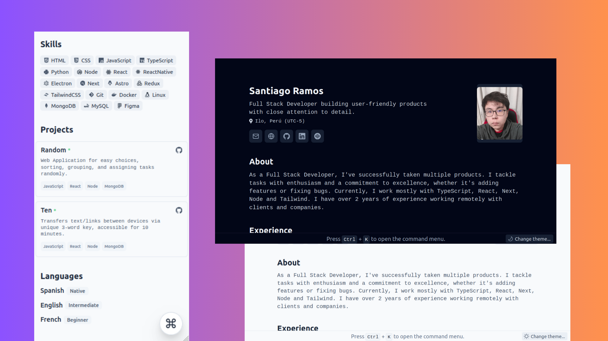

<div align='center'>


<h2><em>Minimalist</em> Résumé styled for WEB and PDF</h2>
<p>Based on the design by <a href='https://github.com/BartoszJarocki/cv'>Bartosz Jarocki</a> and <a href='https://github.com/midudev/minimalist-portfolio-json'>Miguel Ángel Durán</a></p>

</div>

<div align='center'>

<a href='#🚀-getting-started'>Getting Started</a>
<span>&nbsp;✦&nbsp;</span>
<a href='#🧞-commands'>Commands</a>
<span>&nbsp;✦&nbsp;</span>
<a href='#🔑-license'>License</a>
<span>&nbsp;✦&nbsp;</span>
<a href='https://codecatcoffee.com'>Personal</a>

</div>

<p></p>

<div align='center'>


</div>



## 🛠️ Stack

- [**Astro**](https://astro.build/) - The web framework for the modern era.
- [**Typescript**](https://www.typescriptlang.org/) - JavaScript with syntax for types.
- [**Tailwindcss**](https://tailwindcss.com/) - A utility-first CSS framework for rapidly building custom designs.
- [**Ninja Keys**](https://github.com/ssleptsov/ninja-keys) - Dropdown menu with keyboard shortcuts made in pure Javascript.

## 🚀 Getting Started

### 1. Use this [repo](https://github.com/codecatcoffee/resume) as a template for an Astro project

I use [pnpm](https://pnpm.io/installation) as a dependency manager and packager.

```bash
# Enable pnpm on MacOS, WSL & Linux:
corepack enable
corepack prepare pnpm@latest --activate

# Initialize the project
pnpm create astro@latest --template codecatcoffee/resume
```

### 2. Add your content:

Edit the `resume.json` file to create your own printable Resume/CV.

### 3. Launch the development server:

```bash
# Enjoy the result
pnpm dev
```

Open [**http://localhost:4321**](http://localhost:4321/) in your browser to see the result 🚀

## 🧞 Commands

|     | Comando          | Acción                                        |
| :-- | :--------------- | :-------------------------------------------- |
| ⚙️  | `dev` o `start` | Launches a local development server at `localhost:4321`.  |
| ⚙️  | `build`          | Checks for possible errors and builds for production in `./dist/`.      |
| ⚙️  | `preview`        | Preview locally at `localhost:4321` |

## 🔑 License

[MIT](./LICENSE) - Created by [**CodeCatCoffee**](https://codecatcoffe.com).
